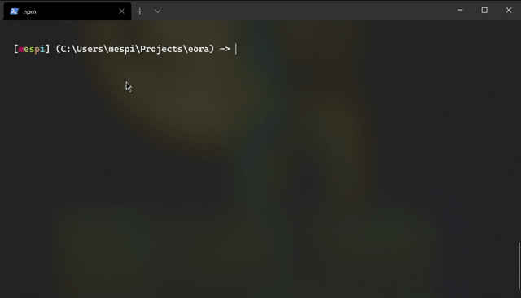

## Eora

This is a 'shell' made in NodeJS.

Features:
* ls, pwd, exit, cd, echo (these are for Windows, in unix-based OS you can use the OS's built-in)
* autocompleting for built-in commands and binaries located inside $PATH

Install dependencies:
`npm install`

Run:
`npm start`

Making a binary (optional):
`npm run package`